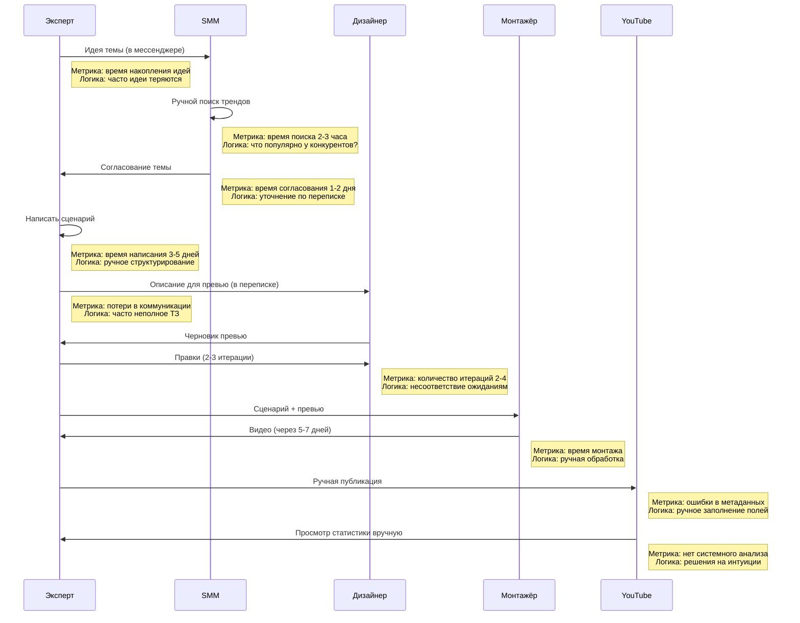
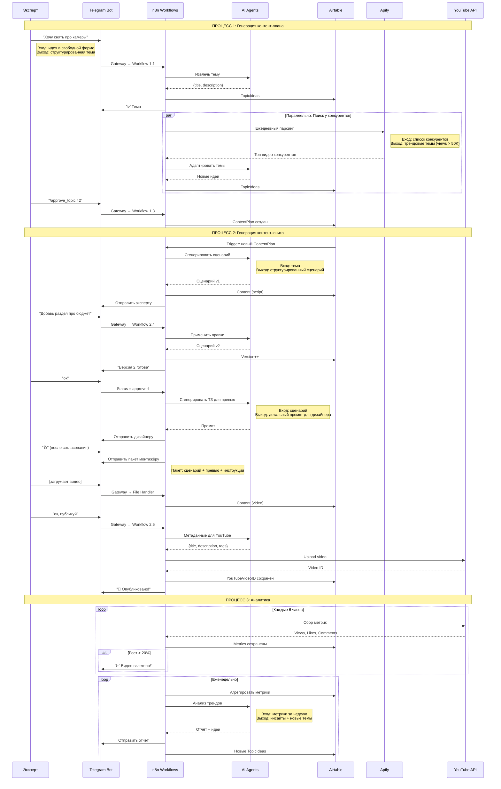
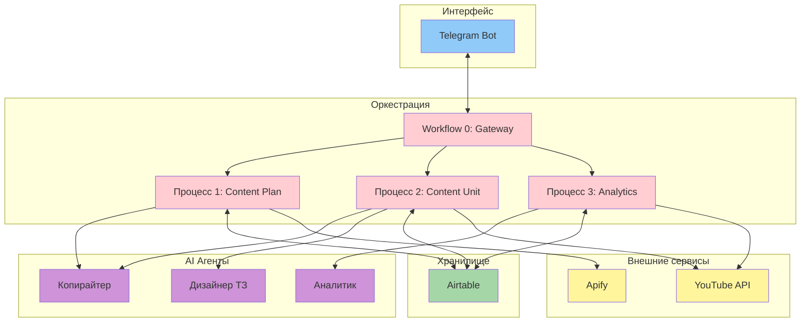
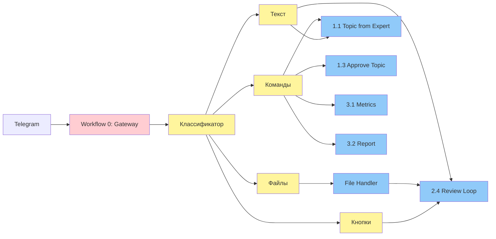
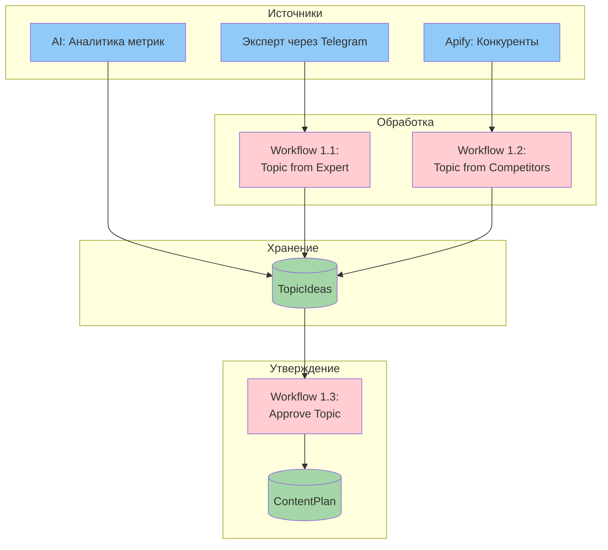
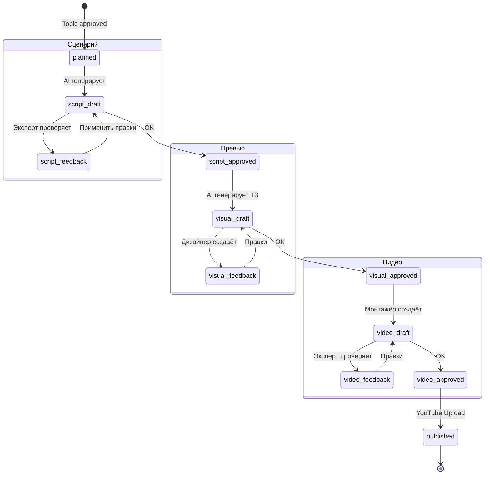
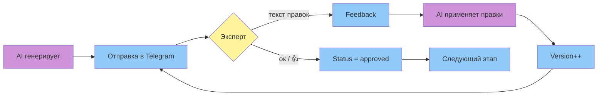
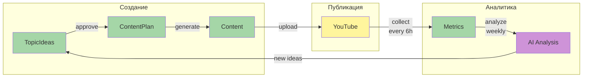

# AIOps-агент: YouTube Content Production System

**Автор:** Астапенко Артем

**Автоматизация производства видеоконтента для YouTube-каналов**

## Слайд 1: Обзор

Полный цикл автоматизации производства YouTube-контента от идеи до публикации с помощью n8n и AI-агентов.

## Слайд 2: Контекст

- **Задача:** автоматизировать создание YouTube-контента от идеи до публикации
- **Почему важно:** скорость выпуска, качество контента, регулярность публикаций
- **Подход:** n8n + AI-агенты — замкнутый цикл с аналитикой и обратной связью

## Слайд 3: Типичная персона (YouTube Creator)

- Эксперт/блогер с аудиторией 10K-100K подписчиков
- Команда: эксперт, SMM-менеджер, дизайнер, монтажёр
- **Проблемы:**
  - Нет системы накопления идей
  - Ручной поиск трендов у конкурентов
  - Долгий цикл производства (2-3 недели на видео)
  - Нет данных для принятия решений о темах

## Слайд 4: AS-IS процесс (ручной)



## Слайд 5: TO-BE процесс (n8n + AI)



## Слайд 6: Архитектура системы

### Компоненты



## Слайд 7: Telegram Gateway Pattern

**Важно:** Telegram API позволяет только один webhook на бота. Решение: единая точка входа (Gateway), которая роутит сообщения в нужные workflows.



## Слайд 8: Процесс 1: Генерация контент-плана

### Три источника идей



### Workflow 1.2: Мониторинг конкурентов (Apify)

- **Триггер:** Schedule (ежедневно)
- **Входы:** Список конкурентов из Airtable.Competitors
- **Процесс:**
  1. Получить список активных конкурентов
  2. Для каждого: запустить Apify YouTube Scraper
  3. Фильтр: views > 50,000
  4. AI адаптирует темы под вашу аудиторию
  5. Проверка на дубликаты
  6. Создание TopicIdeas
- **Выход:** Новые темы + уведомление в Telegram

## Слайд 9: Процесс 2: Генерация контент-юнита

### Жизненный цикл контента



### Feedback Loop через Telegram



## Процесс 3: Аналитика

### Замкнутый цикл



### Workflow 3.1: Сбор метрик

- **Триггер:** Schedule (каждые 6 часов)
- **Процесс:**
  1. Получить опубликованные видео из Content
  2. Для каждого: YouTube API → получить метрики
  3. Сравнить с предыдущими значениями
  4. Если рост > 20% → алерт в Telegram
  5. Сохранить в Metrics
- **Выход:** Актуальные метрики + алерты о резких изменениях

### Workflow 3.2: Аналитический отчёт

- **Триггер:** Schedule (еженедельно) или команда `/report`
- **Процесс:**
  1. Агрегировать метрики за период
  2. AI анализирует тренды
  3. Генерация инсайтов и рекомендаций
  4. Генерация новых тем на основе успешного контента
  5. Создание TopicIdeas (source=analytics)
  6. Отправка отчёта в Telegram
- **Выход:** Отчёт + новые темы

## Схема данных (Airtable)

```mermaid
erDiagram
    Competitors ||--o{ TopicIdeas : monitors
    TopicIdeas ||--o| ContentPlan : approved_to
    ContentPlan ||--|{ Content : has_artifacts
    Content ||--|{ Metrics : collects

    Competitors {
        int ID
        string Name
        string YouTubeChannelID
        string URL
        enum Category
        bool IsActive
        date LastChecked
    }

    TopicIdeas {
        int ID
        string Title
        text Description
        enum Source
        string SourceURL
        link CompetitorID
        int CompetitorViews
        enum Status
        int Priority
        date CreatedAt
    }

    ContentPlan {
        int ID
        link TopicIdeaID
        string Title
        date PlannedDate
        enum Status
        enum CurrentStage
        text ExpertFeedback
        date PublishedAt
    }

    Content {
        int ID
        link ContentPlanID
        enum Type
        int Version
        text Content
        string MediaURL
        enum Status
        text ExpertComment
        string YouTubeVideoID
        date ApprovedAt
    }

    Metrics {
        int ID
        link ContentID
        string YouTubeVideoID
        date CollectedAt
        int Views
        int Likes
        int Comments
        int WatchTime
        float CTR
        int SubscribersGained
    }
```



## 6 ключевых метрик

1. **Время цикла производства (Cycle Time), дни** = `PublishedAt - CreatedAt`
   - Измеряет: скорость от идеи до публикации
   - Цель: сократить с 14-21 дней до 7-10 дней

2. **Доля тем из аналитики (Data-Driven Topics), %** = `topics from analytics / all topics`
   - Измеряет: качество принятия решений на основе данных
   - Цель: > 40%

3. **Количество итераций фидбека (Feedback Loops), шт** = `версии - 1`
   - Измеряет: качество первого прохода AI
   - Цель: < 2 итерации на этап

4. **Охват на видео (Avg Views per Video)** = `sum(Views) / count(Videos)`
   - Измеряет: успешность тем и качество контента
   - Цель: рост на 20% за квартал

5. **Регулярность публикаций (Publishing Consistency), %** = `вовремя / запланировано`
   - Измеряет: стабильность процесса
   - Цель: > 90%

6. **Стоимость производства видео (Cost per Video), руб** = `(затраты команды + AI) / видео`
   - Измеряет: экономическая эффективность
   - Цель: снижение на 30%

## Почему эти метрики

- **Cycle Time** → показывает эффективность процесса и скорость реакции на тренды
- **Data-Driven Topics** → измеряет переход от интуитивных решений к аналитическим
- **Feedback Loops** → качество AI генерации и точность промптов
- **Avg Views** → прямой бизнес-результат и качество контента
- **Publishing Consistency** → стабильность процесса и предсказуемость для аудитории
- **Cost per Video** → экономическая эффективность автоматизации

**Как читаем отклонения:**
- если растёт Feedback Loops — улучшаем промпты или добавляем контекст
- если падает Avg Views — анализируем темы и адаптируем критерии отбора
- если падает Consistency — ищем узкие места в процессе

## Таблица ДО / ПОСЛЕ

| Процесс | Метрика | ДО (AS-IS) | ПОСЛЕ (TO-BE) | Как считается | Эффект |
|---------|---------|------------|---------------|---------------|--------|
| Идеация | Потеря идей | **~30%** | **0%** | структурированное хранение | больше контента |
| Исследование | Время поиска трендов | **2-3 часа/день** | **автоматически** | Apify ежедневно | экономия 15 ч/нед |
| Производство | Цикл видео | **14-21 день** | **7-10 дней** | PublishedAt - CreatedAt | 2x скорость |
| Коммуникация | Итерации правок | **2-4 на этап** | **1-2 на этап** | версии артефакта | меньше переделок |
| Публикация | Ошибки в метаданных | **~20%** | **< 5%** | ручной аудит | качество |
| Аналитика | Принятие решений | **на интуиции** | **data-driven** | % тем из analytics | > 40% |
| Стоимость | Затраты на видео | **100%** | **~70%** | (время * ставка) / видео | экономия 30% |
| Регулярность | Публикации в срок | **60-70%** | **> 90%** | вовремя / запланировано | стабильность |

*Данные на основе анализа типичного YouTube-канала с командой 4 человека.*

## Роли и KPI

| Роль | Задачи ДО | Задачи ПОСЛЕ | KPI ДО | KPI ПОСЛЕ | План обучения |
|------|-----------|--------------|--------|-----------|---------------|
| Эксперт | идеи в голове, ручное написание | быстрый фидбек через Telegram | субъективно | итерации < 2, cycle time | регламент работы с ботом |
| SMM | ручной поиск, согласования | контроль метрик, утверждение тем | время на рутину | data-driven topics > 40% | дашборд аналитики |
| Дизайнер | неполные ТЗ, много правок | чёткие промпты от AI | итерации 2-4 | итерации < 2 | формат ТЗ от AI |
| Монтажёр | сбор материалов вручную | готовый пакет автоматически | время сборки | — | структура пакета |
| DevOps | отсутствует | мониторинг workflows | — | uptime > 99%, latency | регламент мониторинга |

## Технологический стек

| Компонент | Назначение | Лимиты | Стоимость |
|-----------|------------|--------|-----------|
| **n8n** | Оркестрация workflows | depends on plan | $20-50/мес |
| **Telegram Bot** | Интерфейс для команды | без лимитов | бесплатно |
| **Airtable** | База данных | 5 req/sec, 1000 records | free tier |
| **YouTube Data API** | Публикация + метрики | 10,000 units/day | бесплатно |
| **Apify** | Парсинг конкурентов | depends on actor | ~$5/1000 runs |
| **OpenAI/Claude** | AI-генерация | depends on model | ~$0.01/1K tokens |

**Итого:** ~$100-150/мес для канала с 2-4 видео/неделю

## Список workflows (13 workflows)

### Workflow 0: Gateway
- **0.0 Telegram Gateway** — единая точка входа, роутинг всех сообщений

### Процесс 1: Контент-план (3 workflows)
- **1.1 Topic from Expert** — обработка идей эксперта
- **1.2 Topic from Competitors** — Apify парсинг конкурентов (Schedule)
- **1.3 Approve Topic** — утверждение темы → ContentPlan

### Процесс 2: Контент-юнит (5 workflows)
- **2.1 Script Generation** — AI генерирует сценарий (Airtable trigger)
- **2.2 Visual Generation** — AI генерирует ТЗ для превью
- **2.3 Video Production** — сборка пакета для монтажёра
- **2.4 Review Loop** — обработка фидбека (из Gateway)
- **2.5 YouTube Publishing** — публикация на YouTube

### Процесс 3: Аналитика (2 workflows)
- **3.1 Metrics Collection** — сбор метрик YouTube (Schedule: 6h)
- **3.2 Analytics Report** — AI-анализ + новые темы (Schedule: weekly)

## Критические интеграции

### YouTube Data API v3
- Upload video: ~1600 units
- Get statistics: 1 unit
- Лимит: 10,000 units/day
- Означает: ~6 видео/день + неограниченные метрики

### Apify
- Actor: YouTube Channel Scraper
- Входы: channel URL, maxVideos
- Выходы: video title, views, date, thumbnail
- Стоимость: ~$0.005 per video scraped

### OpenAI API
- GPT-4: сценарии, промпты, анализ (~$0.03/1K tokens)
- GPT-3.5: классификация, извлечение (~$0.002/1K tokens)
- Средний сценарий: ~2K tokens = $0.06

## Пример взаимодействия (User Journey)

### День 1: Добавление темы
```
09:00 — Эксперт → TG: "Хочу снять про беззеркалки для начинающих"
09:01 — Bot: "✅ Тема #47 добавлена в TopicIdeas"

14:30 — SMM → TG: "/topics"
14:30 — Bot: Список тем с приоритетами
14:31 — SMM → TG: "/approve_topic 47"
14:31 — Bot: "✅ Тема #47 утверждена. ContentPlan #12 создан"
```

### День 2: Сценарий
```
10:00 — (автоматически) Workflow 2.1 triggered
10:05 — Bot → Эксперт: "📝 Сценарий готов: [ссылка Airtable]"
11:30 — Эксперт → TG: "Добавь раздел про бюджет до 50К"
11:31 — Bot: "⏳ Применяю правки..."
11:33 — Bot: "✅ Версия 2 готова: [ссылка]"
14:00 — Эксперт → TG: "ок"
14:00 — Bot: "✅ Сценарий утверждён. Следующий этап: превью"
```

### День 3: Превью
```
09:00 — (автоматически) Workflow 2.2 triggered
09:02 — Bot → Дизайнер: "🎨 ТЗ для превью: [детальный промпт]"
16:30 — Дизайнер → TG: [загружает изображение]
16:30 — Bot → Эксперт: "Превью готово: [изображение]"
17:00 — Эксперт → TG: "👍"
17:00 — Bot: "✅ Превью утверждено. Следующий этап: видео"
```

### День 4-8: Видео
```
10:00 — (автоматически) Workflow 2.3 triggered
10:02 — Bot → Монтажёр: "🎬 Пакет для монтажа: [сценарий, превью, инструкции]"

День 8, 15:00 — Монтажёр → TG: [загружает видео]
15:00 — Bot → Эксперт: "Видео готово: [видео]"
16:00 — Эксперт → TG: "ок, публикуй"
16:00 — Bot: "⏳ Публикую на YouTube..."
16:03 — Bot: "🎉 Опубликовано: https://youtu.be/xxx"
```

### Далее: Аналитика
```
Каждые 6 часов — сбор метрик
Если резкий рост — Bot: "📈 Видео 'Беззеркалки' +35% views за 6 часов!"

Каждую неделю — Bot: "📊 Еженедельный отчёт: [анализ + 3 новые темы из трендов]"
```

## Экономический эффект: модель

### Допущения

| Параметр | Значение | Источник |
|----------|----------|----------|
| Видео в месяц | 8 | 2/неделю |
| Ставка эксперта | 3,000 руб/час | владелец бизнеса |
| Ставка SMM | 1,500 руб/час | специалист |
| Ставка дизайнера | 2,000 руб/час | фрилансер |
| Ставка монтажёра | 2,500 руб/час | специалист |

### Экономия времени (на 1 видео)

| Этап | ДО (часы) | ПОСЛЕ (часы) | Экономия | Роль |
|------|-----------|--------------|----------|------|
| Поиск идей | 2 | 0 | 2 ч | SMM |
| Согласование темы | 3 | 0.5 | 2.5 ч | SMM + Эксперт |
| Написание сценария | 8 | 1 (фидбек) | 7 ч | Эксперт |
| ТЗ для дизайнера | 1 | 0.2 | 0.8 ч | Эксперт |
| Итерации превью | 2 | 0.5 | 1.5 ч | Дизайнер + Эксперт |
| Сборка для монтажёра | 1 | 0 | 1 ч | SMM |
| Публикация | 0.5 | 0.1 | 0.4 ч | SMM |
| Анализ метрик | 2 | 0.2 | 1.8 ч | SMM |
| **ИТОГО** | **19.5 ч** | **2.5 ч** | **17 ч** | |

### Расчёт экономии в месяц (8 видео)

```
Экономия времени = 17 ч * 8 видео = 136 часов/мес

Распределение по ролям:
- Эксперт: 11.3 ч * 8 = 90.4 ч * 3,000 = 271,200 руб
- SMM: 4.7 ч * 8 = 37.6 ч * 1,500 = 56,400 руб
- Дизайнер: 1 ч * 8 = 8 ч * 2,000 = 16,000 руб

Итого экономия: ~343,600 руб/мес
```

### Затраты на автоматизацию

**CapEx (разовые):**
- Настройка n8n workflows: 120,000 руб
- Настройка интеграций: 40,000 руб
- Обучение команды: 20,000 руб
- **Итого CapEx: 180,000 руб**

**OpEx (ежемесячные):**
- n8n Cloud (Pro): 3,000 руб/мес
- OpenAI API: 5,000 руб/мес (8 видео)
- Apify: 2,000 руб/мес
- Airtable: 0 руб (free tier)
- **Итого OpEx: 10,000 руб/мес**

## ROI

**Чистая экономия в месяц:**
```
343,600 руб (экономия времени) - 10,000 руб (OpEx) = 333,600 руб/мес
```

**Годовой эффект:**
```
333,600 * 12 = 4,003,200 руб/год
```

**ROI (годовой):**
```
ROI = (4,003,200 - 180,000) / 180,000 = 21.2x
```

**Payback Period:**
```
180,000 / 333,600 ≈ 0.54 месяца (~16 дней)
```

## Дополнительные эффекты (не в ROI)

### Качественные улучшения

1. **Регулярность публикаций:** 60% → 90%
   - Эффект: стабильный рост аудитории
   - Алгоритм YouTube поощряет регулярность

2. **Data-driven решения:** 0% → 40%+
   - Эффект: больше успешных видео
   - Меньше "провальных" тем

3. **Скорость реакции на тренды:** 2-3 недели → 7-10 дней
   - Эффект: больше актуального контента
   - Конкурентное преимущество

### Возможный рост метрик

- Avg Views per Video: +20-30% (за счёт лучших тем)
- Subscribers Growth: +15-25% (регулярность)
- Watch Time: +10-15% (качество сценариев)

**Дополнительный доход** (для канала с монетизацией):
```
Если текущий доход от рекламы: 200,000 руб/мес
Рост на 20% → +40,000 руб/мес → +480,000 руб/год
```

**Итого полный эффект:** 4,003,200 + 480,000 = **~4,5 млн руб/год**

## Риски и митигация

| Риск | Вероятность | Влияние | Митигация |
|------|-------------|---------|-----------|
| YouTube API quota exceeded | Средняя | Высокое | Мониторинг квот + fallback на ручную публикацию |
| AI генерирует некачественный контент | Высокая (начало) | Среднее | Feedback loop + дообучение промптов |
| Telegram webhook недоступен | Низкая | Высокое | Health check + alerts + retry logic |
| Airtable rate limit | Низкая | Среднее | Throttling в n8n + queue |
| Apify не находит тренды | Средняя | Низкое | Fallback на ручной поиск + другие источники |
| Сопротивление команды новому процессу | Высокая | Среднее | Обучение + постепенное внедрение |

## Мониторинг и алерты

### Technical Metrics
- n8n workflow execution time
- n8n error rate
- API latency (YouTube, Airtable, OpenAI)
- Webhook uptime

### Business Metrics
- Cycle Time (по этапам)
- Feedback Loops (по артефактам)
- Publishing Consistency
- Data-Driven Topics %

### Alerts
```
⚠️ Workflow failed 3 times in a row
⚠️ YouTube quota > 80%
⚠️ Cycle Time > 12 days
⚠️ Feedback Loops > 3 на этап
📈 Video views +50% за 6 часов
📉 Publishing behind schedule
```

## Дашборд (6 блоков метрик)

### 1. Technical Health
- Workflow Success Rate (target: > 95%)
- Avg Execution Time (target: < 30 sec)
- API Error Rate (target: < 2%)
- Webhook Uptime (target: > 99%)

### 2. Process Efficiency
- Avg Cycle Time (target: < 10 days)
- Avg Feedback Loops (target: < 2)
- Publishing On-Time % (target: > 90%)
- Cost per Video (target: < 70% от базового)

### 3. Content Quality
- Avg Views per Video (trend)
- Engagement Rate (likes+comments/views)
- Avg Watch Time %
- Subscribers Gained per Video

### 4. AI Performance
- Script Quality Score (от эксперта, 1-5)
- Visual Prompt Quality (1-5)
- Feedback Integration Success (%)
- Analytics Insights Relevance (1-5)

### 5. Topic Pipeline
- TopicIdeas в очереди
- Источник тем (breakdown)
- Approval Rate (%)
- Время от идеи до утверждения

### 6. Team Adoption
- Команда активности в Telegram
- Avg Response Time (фидбек)
- Использование команд (breakdown)

## Roadmap внедрения (3 месяца)

### Месяц 1: Пилот (Процесс 1)

**Цель:** Протестировать сбор и утверждение тем

- Неделя 1: Setup (Airtable, Telegram, n8n)
- Неделя 2: Workflows 0, 1.1, 1.3
- Неделя 3: Workflow 1.2 (Apify)
- Неделя 4: Тестирование + обучение команды

**KPI:** 10+ тем в TopicIdeas, 3+ утверждённые

### Месяц 2: Производство (Процесс 2)

**Цель:** Автоматизировать создание контента

- Неделя 5-6: Workflows 2.1, 2.4 (сценарий + фидбек)
- Неделя 7: Workflows 2.2, 2.3 (превью + видео)
- Неделя 8: Workflow 2.5 (публикация) + тестирование

**KPI:** 2 видео опубликовано через систему

### Месяц 3: Аналитика (Процесс 3)

**Цель:** Замкнуть цикл через данные

- Неделя 9: Workflow 3.1 (метрики)
- Неделя 10: Workflow 3.2 (отчёты)
- Неделя 11-12: Оптимизация промптов + полное тестирование

**KPI:** 1 отчёт сгенерирован, 3+ темы из аналитики

### Далее: Масштабирование
- A/B тестирование промптов
- Дообучение на исторических данных
- Интеграция с другими источниками (Reddit, Twitter)
- Автоматизация монтажа (через AI video tools)

## Связь с task1 (TO-BE диаграмма)

Система реализует 19 точек автоматизации из TO-BE:

| # | Автоматизация | Реализация в системе |
|---|---------------|----------------------|
| 1-4 | Планирование | Процесс 1: TopicIdeas → ContentPlan |
| 5 | Генерация черновиков | Workflow 2.1: AI Script |
| 6 | Маршрутизация | Workflow 2.4: Review Loop |
| 7 | ТЗ для визуала | Workflow 2.2: AI Thumbnail Prompt |
| 8-9 | Генерация визуалов | AI → Designer через Telegram |
| 10-12 | Монтаж | Workflow 2.3: Package → Editor |
| 13 | Согласование | Workflow 2.4: Feedback Loop |
| 14-15 | Публикация | Workflow 2.5: YouTube API |
| 16-17 | Сбор метрик | Workflow 3.1: YouTube API |
| 18 | Отчёты | Workflow 3.2: AI Analysis |
| 19 | Новые темы | Workflow 3.2 → TopicIdeas |

## Команды Telegram Bot

| Команда | Описание | Пример |
|---------|----------|--------|
| (текст) | Добавить новую тему | "Хочу снять про дроны" |
| `/topics` | Список всех тем | Показать TopicIdeas |
| `/approve_topic <id>` | Утвердить тему | `/approve_topic 42` |
| `/status` | Статус контента в работе | Показать ContentPlan |
| `/metrics` | Собрать метрики сейчас | Запустить Workflow 3.1 |
| `/report` | Аналитический отчёт | Запустить Workflow 3.2 |
| `ок` или `👍` | Утвердить артефакт | После сценария/превью/видео |
| (текст при review) | Правки к артефакту | "Добавь раздел про бюджет" |
| (файл: изображение) | Загрузить превью | От дизайнера |
| (файл: видео) | Загрузить видео | От монтажёра |

## AI Агенты и промпты

### AI_CPY (Copywriter)

**Задачи:**
- Извлечь тему из свободного текста
- Сгенерировать структурированный сценарий
- Применить правки от эксперта

**Ключевые инструкции:**
- Hook (первые 5 секунд)
- Структура: проблема → решение → CTA
- Tone of Voice: дружелюбный, экспертный
- Длина: 8-12 минут

### AI_DSG (Design Brief Generator)

**Задачи:**
- Сгенерировать детальный промпт для превью
- Описать композицию, цвета, текст

**Ключевые инструкции:**
- Яркие контрастные цвета
- Читаемый текст (3-5 слов)
- Эмоциональное лицо (если применимо)
- CTR-оптимизация

### AI_ANA (Analytics Analyst)

**Задачи:**
- Анализ трендов в метриках
- Генерация инсайтов
- Рекомендации новых тем

**Ключевые инструкции:**
- Сравнить с предыдущим периодом
- Выявить аномалии
- Найти паттерны успешных видео
- Предложить 3-5 тем

## Заключение

### Что реализовано
- Полный цикл производства YouTube-контента
- 13 workflows в n8n
- 3 AI-агента (копирайтер, дизайнер ТЗ, аналитик)
- Telegram-интерфейс для команды
- Замкнутый цикл с аналитикой

### Ключевые результаты
- **Cycle Time:** 14-21 день → 7-10 дней (**2x быстрее**)
- **Экономия времени:** 136 часов/мес = **343,600 руб/мес**
- **ROI:** **21.2x** (годовой)
- **Payback:** **16 дней**
- **Регулярность:** 60% → 90%

### Следующие шаги
1. Пилотное внедрение (3 месяца)
2. Оптимизация промптов на реальных данных
3. A/B тестирование разных подходов
4. Масштабирование на другие каналы
5. Интеграция с video AI tools для автомонтажа

## Демо и материалы

### Репозиторий
- **GitHub:** [ссылка на task3/]
- Документация: `docs/`
- Диаграммы: `diagrams/`
- n8n workflows: `workflows/` (JSON для импорта)

### Видео-демо
- Процесс 1: Добавление темы через Telegram
- Процесс 2: Фидбек-цикл на сценарий
- Процесс 3: Аналитический отчёт

### Контакты
- Telegram: @username
- Email: email@example.com

## Часто задаваемые вопросы

**Q: Можно ли использовать другую LLM вместо OpenAI?**
A: Да, n8n поддерживает Anthropic (Claude), Google (Gemini), Ollama (локально).

**Q: Что если Telegram webhook упадёт?**
A: Health check каждые 5 минут + алерты. Можно использовать Polling mode как fallback.

**Q: Как масштабируется на 10+ видео в неделю?**
A: Увеличить YouTube API quota (платный план), оптимизировать промпты, добавить очередь.

**Q: Можно ли адаптировать для TikTok/Instagram?**
A: Да, меняются только API публикации и формат контента. Логика та же.

**Q: Сколько времени на внедрение?**
A: 3 месяца пилот, затем 1-2 недели на каждый новый канал.
