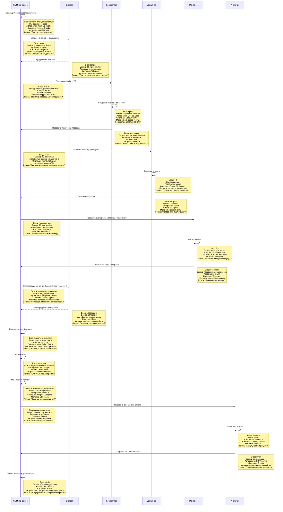

# AS-IS Диаграмма процесса производства контента

```mermaid
sequenceDiagram
participant SMM as SMM-менеджер
participant EXP as Эксперт
participant COPY as Копирайтер
participant DSG as Дизайнер
participant VID as Монтажёр
participant ANA as Аналитик

SMM->>SMM: Инициация производства контента
note right of SMM: Вход: контент-план, инфоповоды<br>Выход: список задач<br>Артефакты: таблица задач<br>Системы: Notion, Sheets<br>Метрика: полнота тем<br>Логика: "Все ли темы закрыты?"

SMM->>EXP: Запрос исходной информации
note right of SMM: Вход: темы<br>Выход: уточнённый бриф<br>Артефакты: бриф<br>Системы: Telegram<br>Метрика: скорость ответа<br>Логика: "Достаточно ли данных?"

EXP-->>SMM: Передача материалов
note right of EXP: Вход: запрос<br>Выход: данные, ссылки<br>Артефакты: материалы<br>Системы: Telegram<br>Метрика: полнота данных<br>Логика: "Все ли сведения предоставил?"

SMM->>COPY: Передача брифа и ТЗ
note right of SMM: Вход: бриф<br>Выход: задача для копирайтера<br>Артефакты: ТЗ<br>Системы: Notion<br>Метрика: корректность ТЗ<br>Логика: "Понятно ли копирайтеру задание?"

COPY->>COPY: Создание черновиков текстов
note right of COPY: Вход: бриф<br>Выход: черновики текстов<br>Артефакты: Google Docs<br>Системы: Docs, ChatGPT<br>Метрика: качество текста<br>Логика: "Цепляет ли текст?"

COPY->>SMM: Передача текстов на проверку
note right of COPY: Вход: черновики<br>Выход: версия для проверки<br>Артефакты: документ<br>Системы: Docs<br>Метрика: полнота<br>Логика: "Нужно ли что-то уточнить?"

SMM->>DSG: Передача текста для визуала
note right of SMM: Вход: текст<br>Выход: ТЗ на визуал<br>Артефакты: ссылка на документ<br>Системы: Figma, Telegram<br>Метрика: ясность ТЗ<br>Логика: "Как визуал должен передать мысль?"

DSG->>DSG: Создание визуала
note right of DSG: Вход: ТЗ<br>Выход: визуал<br>Артефакты: макет<br>Системы: Figma, Midjourney<br>Метрика: соответствие бренду<br>Логика: "Достаточно ли выразительно?"

DSG->>SMM: Передача визуала
note right of DSG: Вход: визуал<br>Выход: черновик<br>Артефакты: макет<br>Системы: Figma<br>Метрика: корректность<br>Логика: "Готово ли к публикации?"

SMM->>VID: Передача сценария и материалов для видео
note right of SMM: Вход: текст, визуал<br>Выход: ТЗ монтажёру<br>Артефакты: материалы<br>Системы: Telegram<br>Метрика: полнота ТЗ<br>Логика: "Хватит ли данных монтажёру?"

VID->>VID: Монтаж видео
note right of VID: Вход: ТЗ<br>Выход: черновое видео<br>Артефакты: видеофайл<br>Системы: CapCut, Premiere<br>Метрика: retention<br>Логика: "Работает ли первая секунда?"

VID->>SMM: Отправка видео на правки
note right of VID: Вход: черновик<br>Выход: предварительная версия<br>Артефакты: файл<br>Системы: Telegram<br>Метрика: количество правок<br>Логика: "Нужны ли уточнения?"

SMM->>EXP: Согласование контента |Если эксперт участвует|
note right of SMM: Вход: финальные черновики<br>Выход: подтверждение<br>Артефакты: документ, макет<br>Системы: Docs, Figma<br>Метрика: скорость согласования<br>Логика: "Передаёт ли контент экспертность?"

EXP-->>SMM: Подтверждение или правки
note right of EXP: Вход: материалы<br>Выход: ok/правки<br>Артефакты: комментарии<br>Системы: Docs<br>Метрика: количество доработок<br>Логика: "Точно ли отражена мысль?"

SMM->>SMM: Подготовка к публикации
note right of SMM: Вход: финальный контент<br>Выход: пост в черновиках<br>Артефакты: пост<br>Системы: Meta Suite, TikTok<br>Метрика: корректность форматов<br>Логика: "Все ли элементы на месте?"

SMM->>SMM: Публикация
note right of SMM: Вход: черновик<br>Выход: опубликованный контент<br>Артефакты: пост, видео<br>Системы: Meta Suite<br>Метрика: своевременность<br>Логика: "Оптимальное ли время?"

SMM->>SMM: Мониторинг реакции
note right of SMM: Вход: комментарии, статистика<br>Выход: отчёт о реакции<br>Артефакты: таблица<br>Системы: Insights, Analytics<br>Метрика: ER, reach<br>Логика: "Как аудитория реагирует?"

SMM->>ANA: Передача данных для отчёта
note right of SMM: Вход: сырая аналитика<br>Выход: данные для анализа<br>Артефакты: таблицы<br>Системы: Sheets<br>Метрика: полнота данных<br>Логика: "Все ли данные собраны?"

ANA->>ANA: Аналитика и отчёт
note right of ANA: Вход: данные<br>Выход: отчёт<br>Артефакты: дашборд<br>Системы: Looker, Sheets<br>Метрика: точность<br>Логика: "Как улучшить процесс?"

ANA->>SMM: Отправка итогового отчёта
note right of ANA: Вход: отчёт<br>Выход: рекомендации<br>Артефакты: PDF/ссылка<br>Системы: Sheets<br>Метрика: применимость инсайтов<br>Логика: "Сформулированы ли выводы?"

SMM->>SMM: Корректировка контент-плана
note right of SMM: Вход: отчёт<br>Выход: обновлённый план<br>Артефакты: таблица<br>Системы: Notion<br>Метрика: рост метрик в следующем цикле<br>Логика: "Что улучшить в следующем спринте?"
```
